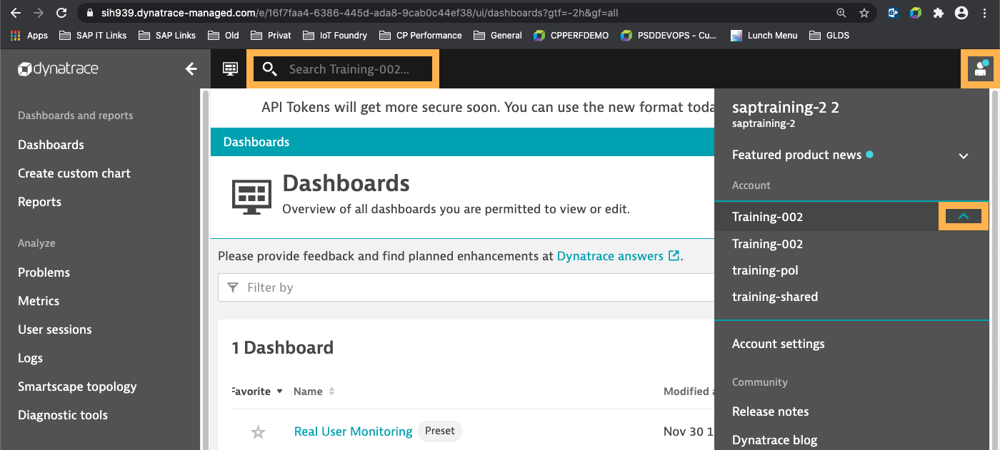

# Exercise: Cloud Foundry application instrumentation

In this exercise you will learn how to instrument an application running on Cloud Foundry with the Dynatrace agent.

## Access your Dynatrace Environment

You will have admin access to your own Dynatrace Environment for this and the following exercises. This environment is called "Training-<Month>-0XX" (the XX being the number of your training user). You might have access to several environments so make sure to select the correct one by following the next steps:

1.	Open your "Training-<Month>-0XX" environment on the [training-cluster](https://sih939.dynatrace-managed.com/login).
    - Log in with the user and password you got handed out
    - Make sure you are logged in to the environment named "Training-<Month>-0XX" (same number as your user number), you should see the name in the search bar.
    - If you are not in the correct environment you can change it in the right upper corner when clicking on the user sign and choosing "Training-<Month>-0XX" in the section "Account". 
2.	Now you should be logged in to your Dynatrace environment.

At this point you have your own environment, but you aren’t monitoring any application yet.

## Get Environment ID and PaaS-Token from Dynatrace

The Dynatrace Agent is downloaded from the Dynatrace cluster during the application staging phase (via the buildpack). For this to work you need to pass the cluster hostname, the environment ID and a PaaS token to the application, so that the agent can be downloaded from the correct cluster. 

1. In your Dynatrace environment click on "Manage" -> "Deploy Dynatrace" in the left navigation bar.
2. Select "Set up PaaS integration".
3. Copy the Environment ID and save it in some text file.
4. Click "Generate new token".
5. Give the token a name (e.g. "dt-training") and click "Generate".
6. Copy the token and save it in the text file from before.

## Create a user-provided service in Cloud Foundry

In this step you will create a user-provided service containing the cluster hostname, environment ID and PaaS token from the previous steps.

**Note For Windows: Open Git Bash to execute the following commands.**

1. Login to your Cloud Foundry space (that you set up as part of the [Prerequisites](../Prerequisites.md)) via `cf login`.
2. Create a user provided service by executing the following commands:

**Note: Replace `<environmentUUID>` and `<token>` (in the first two lines) with the values saved from the previous step and `D/I number` with your D/I number**  
  
   ```
   export environmentid=<Environment ID>
   export apitoken=<PaaS-Token>
   export hostname=sih939.dynatrace-managed.com
   cf cups dynatrace-service-<D/I number> -p '{"environmentid":"'$environmentid'","apitoken":"'$apitoken'","apiurl":"https://'$hostname'/e/'$environmentid'/api"}'
   ```

**Note: It is important that the service name contains "dynatrace" otherwise the buildpack integration doesn't work.**

## Bind the service to the spring-music app

By binding the previously created service to your spring-music app, you make the Dynatrace credentials accessible to the application as environment variables. 

**Note: Replace `D/I number` with your D/I number**  
          
1. In your cf space, check that the spring-music application is deployed via `cf apps`.
2. Bind the service to your app with `cf bind-service spring-music-<D/I number> dynatrace-service-<D/I number>`.
3. Restage the app via `cf restage spring-music-<D/I number>`.

The buildpack instrumentation checks for a dynatrace service binding during staging of the application. If it finds a service having "dynatrace" in its name, it checks the environment variables and downloads the agent from the specified cluster and environment. This is why a restage of the application is necessary and a simple restart is not enough. 

## Execute some requests against your app

For Dynatrace to receive and display Service data, the application needs to process some requests.

**Note For Windows: Open Git Bash to execute the following commands.**

1. Copy the URL of your application (you can find it out via the `cf apps` command).
2. Execute a prepared script, that calls some services of your spring-music app by executing (from inside the `spring-music` folder)
`./scripts/execute_requests.sh https://<URL of your application>`

## Explore in Dynatrace

Open the "Application & Microservices" -> "Services" tab in Dynatrace and check if you see a service called "AlbumController" (it might take two minutes for the service to show up). 

If you can see it your instrumentation was successful and Dynatrace received service metrics.
