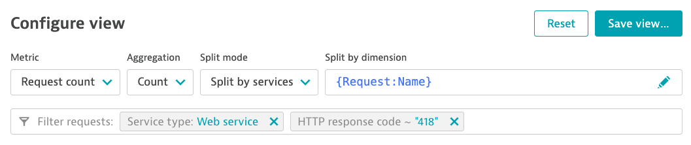

# Exercise: Calculated service metrics

**Note: For this exercise we will use your "Training-<Month>-0XX" environment**

In this exercise you will learn how to:
- configure a calculated service metric from Multi-Dimensional Analysis view
- create a dashboard tile based on the new calculated service metric
- alert based on the new calculated service metric

Dynatrace offers the possibility to configure "Calculated Service Metrics" which allow us to promote captured values from Request Attributes into full-fledged metrics which then can be used in dashboards and alerting.

## Configure alert on requests with response code 418

Dynatrace automatically captures all requests and depending on the response code groups them into successful or failed requests. 
A failed request is further grouped into client (4XX) or server (5XX) errors.
You can display, chart and alert on 4XX and 5XX response code requests out of the box. 
If you are interested in a specific response code, you can configure a calculated service metric to further single out those requests.

In this exercise we want to dashboard and alert on requests with response code 418.

### Trigger request with response code 418

To see a request with the response code 418 in Dynatrace, please open your browser and access the URL `<Your spring-music URL>/errors/response/418`. Keep this window open, as you will need to trigger this request again later.

__Note: If you receive a 404 error code you first need to start your application again. It might have been stopped when running in a trial account.__

### Configure a calculated service metric from the Multi-Dimensional Analysis view

In this exercise we will use the Multi-Dimensional Analysis view to configure the calculated service metric (the alternative configuration possibility would be via "Manage" -> "Settings" -> "Server-side service monitoring" -> "Calculated service metrics").
    
   1. Go to "Applications & Microservices" -> "Multidimensional analysis" -> "Top web requests"
   2. Select (if not already selected by default)
       - Metric: "Request count"
       - Aggregation: "Count"
       - Split mode: "Split by service"
       - Split by dimension: "{Request:Name}"
   3. Add a filter for "HTTP response code" with value "418" (just type 418 even if it doesn't look like it is working :-) )
   4. Remove the filter for "Service Type: Web request service" by clicking on the "X" next to it (Your configuration should look like the screenshot below). 

   5. Click on "Create metric ..." and enter the metric name "Request Count with Response Code 418".
   6. Click on "Create metric".
   
      __Note: You will get the metric key of your calculated service metric. You can use this key to identify and reference your metric when using the Dynatrace API.__
   
   7. Retrigger the response 418 by accessing `<Your spring-music URL>/errors/response/418` with your browser again. Dynatrace will now start collecting data points for this metric.

### Create a custom chart on your calculated service metric

We now want to configure a custom chart for the newly created metric.

1. Go to "Explore data".
2. Select metric "Request Count with Response Code 418" from the drop down.
3. Select the tab "Single value" under "Visual Settings". This will show you now the sum of request counts over all services with response code 418 in the selected time frame.
4. Click on "Pin to dashboard".
5. Select an existing dashboard or create a new dashboard and click on "Pin".
6. Click on "Open dashboard" to see the newly created tile.

### Create a custom event for alerting 

Lets assume that a response with code 418 indicates a certain kind of malfunction in our service and we want Dynatrace to create a problem for us, in case such a response code is observed.
For this you can configure a custom event for alerting, which is described in the following steps.

1. Go to "Manage" -> "Settings" -> "Anomaly detection" -> "Custom events for alerting"
2. Click on "Create custom event for alerting".
3. In the **Metric** section choose "Services" as Category and "Request Count with Response Code 418" as metric. Keep "Value" as aggregation type.

4. Configure the following "Static threshold" in the **Monitoring strategy** section:
   
   "Alert anomalies with a static threshold of **0** **Count (count)**"
   
   "Raise an alert if the metric is **above** the threshold for **1** minutes during any **3** minute period."
   
5. Under "Event description" 
  - Enter title "Response code 418 detected".
  - Select "Error" as severity.
  - Enter the following as message: "The {metricname} was {alert_condition} your custom threshold of {threshold}."
6. Save the changes by clicking "Create custom event for alerting".

### Trigger request with response code 418

To see a problem being opened and observe the calculated service metric in your dashboard, please open your browser and access the URL `<Your spring-music URL>/errors/response/418` at least once (or just refresh in case the tab is still open). Feel free to execute multiple requests, you will be able to observe the number of executed requests in the next step. 

### Check your dashboard and your Problems

Check your dashboard tile, you should see a value > 1 depending on how many requests you executed (give it 2-3 min for the requests to be shown).

Also check your "Observe and explore" -> "Problems" section, you should see a problem being opened (latest 4-5 minutes after you triggered the request).
