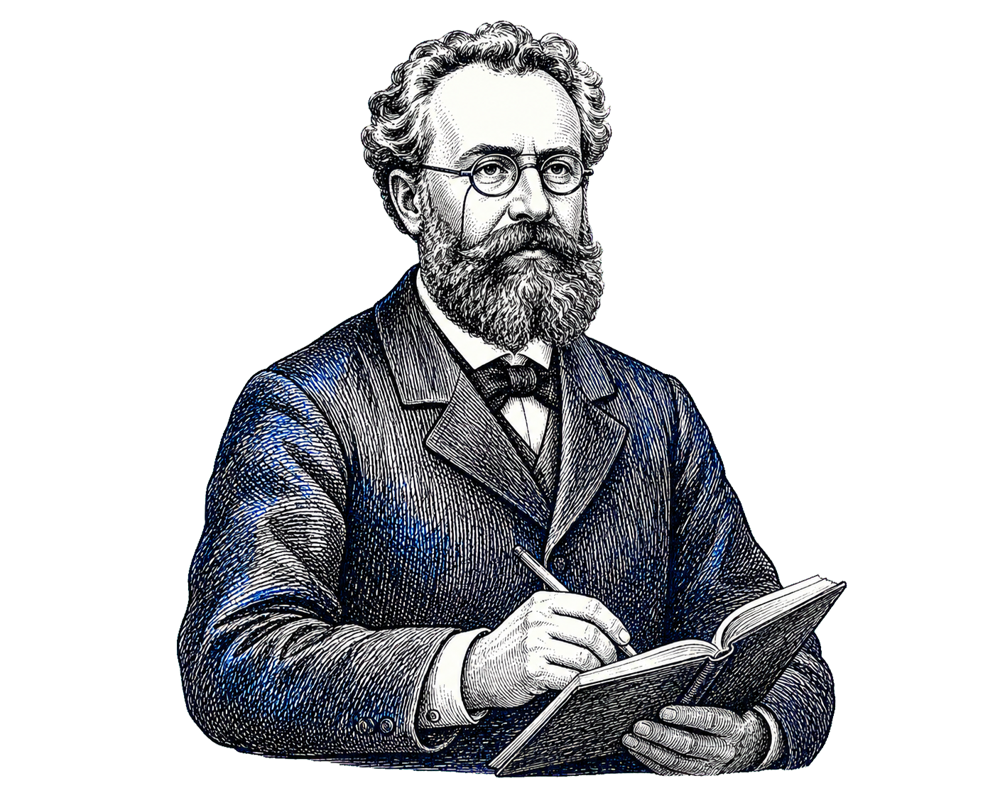

---
layout: default
class: agenda-slide
---

  

    01
    

    <strong>为什么需要 <em>Memory</em></strong>
  

  

    02
    

    <strong><em>OpenClaw</em> Memory 机制介绍</strong>
  

  

    03
    

    <strong><em>PowerMem</em> 的记忆生命周期</strong>
  

  

    04
    

    <strong><em>PowerMem</em> 实践</strong>
  

---
layout: default
class: section-divider section-divider-1
---

  

    01
    <i></i>
  

  <h1>为什么需要 <em>Memory</em></h1>

---
layout: default
title: 为什么需要 Memory
---

  

    
01

    <h3>模型没有跨会话状态</h3>
    
这一轮能利用什么，取决于当前上下文里放进了什么。

  

  

    
02

    <h3>经验需要持续积累</h3>
    
用户偏好、项目背景与技术决策，不应每次从头解释。

  

  

    
03

    <h3>上下文压缩会丢失细节</h3>
    
长对话被压缩或截断后，重要信息可能随之消失。

  

---
layout: default
class: section-divider section-divider-2
---

  

    02
    <i></i>
  

  <h1><em>OpenClaw&ensp;Memory</em> 机制介绍</h1>

---
layout: default
title: OpenClaw 默认的 Memory 机制
---

  

    <h3>Markdown 文件层</h3>
    

      

        <strong>MEMORY.md</strong>
        长期记忆：持久事实、偏好和决策
      

      

        <strong>memory/YYYY-MM-DD.md</strong>
        每日笔记：运行上下文与观察；自动加载今天和昨天
      

    

  

  

    <h3>SQLite 索引层</h3>
    

      

        <strong>BM25 / FTS5</strong>
        全文检索：擅长错误码、变量名、路径和配置项
      

      

        <strong>Vector</strong>
        语义召回：有 embedding 时启用，sqlite-vec 可加速
      

      

        <strong>Hybrid rank</strong>
        融合关键词与向量分数，兼顾精确匹配和语义召回
      

    

  

---
layout: default
title: OpenClaw Memory 写入时机
---

  

    
01

    <h3>显式记忆写入</h3>
    
当用户明确说“记住这个”时，Agent 会把相关信息写入记忆文件。

  

  

    
02

    <h3>自动压缩前写入</h3>
    
会话即将被压缩前，OpenClaw 会触发静默写入，保存关键上下文，避免重要信息随上下文压缩丢失。

  

  

    
03

    <h3>会话切换写入</h3>
    
<code>/new</code> 或 <code>/reset</code> 后，启用的 session-memory hook 会保存上一段会话的最近消息。

  

  

    
04

    <h3>后台整理写入</h3>
    
启用 Dreaming 后，高价值短期记忆会被整理并晋升到 <code>MEMORY.md</code>。

  

---
layout: default
title: OpenClaw Memory 搜索流程
---

  

    

      <Icon name="lucide:bot" />
      

        <strong>Agent</strong>
        发起检索与读取
      

    

    

      <Icon name="lucide:brain-circuit" />
      

        <strong>Memory Core</strong>
        召回、融合与定位
      

    

    

      <Icon name="lucide:database" />
      

        <strong>SQLite / Files</strong>
        索引与原始记忆
      

    

  

  

    <i class="sequence-life life-agent"></i>
    <i class="sequence-life life-core"></i>
    <i class="sequence-life life-store"></i>
    

      <b>1</b><code>memory_search(query)</code>
    

    

      <b>2</b>FTS5 / BM25 → <code>chunks_fts</code>
    

    

      <b>3</b>Vector → <code>chunks_vec</code>
    

    

      <b>4</b>
      <Icon name="lucide:git-merge" />
      hybrid merge / rank
    

    

      <b>5</b>paths + line ranges + snippets
    

    

      <b>6</b><code>memory_get(path, lines)</code>
    

    

      <b>7</b>read Markdown → <code>MEMORY.md / memory/*.md</code>
    

    

      <b>8</b>exact memory excerpt
    

  

  

    <Icon name="lucide:search" />
    
<strong>SQLite 负责搜索索引</strong>保存分块、FTS5 与向量索引，返回候选位置

  

  

    <Icon name="lucide:file-text" />
    
<strong>Markdown 负责保存原文</strong>它才是完整、可编辑的 source of truth

  

---
layout: default
title: OpenClaw 默认 Memory 的不足
---

  

    
01

    <h3>默认单节点</h3>
    
记忆文件和 SQLite 索引默认保存在本地节点，适合个人使用；但在远程 Agent、多设备同步或团队协作场景下，扩展性不足。

  

  

    
02

    <h3>两步检索增加调用成本</h3>
    
默认先通过 <code>memory_search</code> 找到候选片段，再用 <code>memory_get</code> 读取原文，会增加工具调用次数。

  

  

    
03

    <h3>复杂检索能力有限</h3>
    
默认已支持 FTS5 + 向量检索，但在结构化过滤、排序策略、聚合分析和可观测性方面，不如专业搜索引擎灵活。

  

  

    
04

    <h3>长期记忆质量容易下降</h3>
    
每日记忆和会话摘要会持续增长；如果缺少持续去重、更新、删除和整理，长期记忆容易混入重复、过期或低价值内容。

  

---
layout: default
class: section-divider section-divider-3
---

  

    03
    <i></i>
  

  <h1><em>PowerMem</em> 的记忆生命周期</h1>

---
layout: default
title: 重要性评估
---

  

    <svg class="radar-plot" viewBox="0 0 260 240" role="img" aria-label="重要性六维评估模型，外圈为 0.40，每圈递增 0.10">
      <desc>关联度 0.30，新颖度 0.20，情感强度与可操作性均为 0.15，事实性与个人相关性均为 0.10。</desc>
      <g class="radar-grid">
        <polygon points="130,25 216.6,75 216.6,175 130,225 43.4,175 43.4,75" />
        <polygon points="130,50 194.95,87.5 194.95,162.5 130,200 65.05,162.5 65.05,87.5" />
        <polygon points="130,75 173.3,100 173.3,150 130,175 86.7,150 86.7,100" />
        <polygon points="130,100 151.65,112.5 151.65,137.5 130,150 108.35,137.5 108.35,112.5" />
        <line x1="130" y1="125" x2="130" y2="25" />
        <line x1="130" y1="125" x2="216.6" y2="75" />
        <line x1="130" y1="125" x2="216.6" y2="175" />
        <line x1="130" y1="125" x2="130" y2="225" />
        <line x1="130" y1="125" x2="43.4" y2="175" />
        <line x1="130" y1="125" x2="43.4" y2="75" />
      </g>
      <polygon class="radar-value" points="130,50 173.3,100 162.5,143.8 130,162.5 108.35,137.5 108.35,112.5" />
      <g class="radar-points">
        <circle cx="130" cy="50" r="4" />
        <circle cx="173.3" cy="100" r="4" />
        <circle cx="162.5" cy="143.8" r="4" />
        <circle cx="130" cy="162.5" r="4" />
        <circle cx="108.35" cy="137.5" r="4" />
        <circle cx="108.35" cy="112.5" r="4" />
      </g>
    </svg>
    关联度<small>0.30</small>
    新颖度<small>0.20</small>
    情感强度<small>0.15</small>
    可操作性<small>0.15</small>
    事实性<small>0.10</small>
    个人相关性<small>0.10</small>
    
六维 评估模型

  

  

    

      <Icon name="lucide:message-square-text" />
      <strong>输入：</strong>
      待评估消息
    

    

        <Icon name="lucide:bot" />
        <strong>LLM 深度评估</strong>
    

    

        <Icon name="lucide:file-json-2" />
        <strong>返回结构化 JSON</strong>
    

    

        <strong>三级回退解析</strong>
        ① JSON ② 正则 ③ 默认值 0.5
    

    

        <Icon name="lucide:cog" />
        <strong>规则引擎</strong>
    

    

        <strong>信号累加</strong>
        ▣ 内容长度 ⌕ 关键词 ❕ 标点 ⚑ 优先级
    

    

        <Icon name="lucide:chart-no-axes-column-increasing" />
        <strong>分数封顶 1.0</strong>
    

    

      importance_score
      <strong>= 0.72</strong>
      <em>（会议信息示例）</em>
    

    <svg class="importance-connectors-v3" viewBox="0 0 1000 280" preserveAspectRatio="none" aria-hidden="true">
      <defs>
        <marker id="importance-arrow-neutral" markerWidth="6" markerHeight="6" refX="5.5" refY="3" orient="auto">
          <path d="M0,0 L6,3 L0,6 Z" />
        </marker>
        <marker id="importance-arrow-top" markerWidth="6" markerHeight="6" refX="5.5" refY="3" orient="auto">
          <path d="M0,0 L6,3 L0,6 Z" />
        </marker>
        <marker id="importance-arrow-bottom" markerWidth="6" markerHeight="6" refX="5.5" refY="3" orient="auto">
          <path d="M0,0 L6,3 L0,6 Z" />
        </marker>
      </defs>
      <path class="importance-connector-v3 importance-connector-v3-input" d="M149 140 H161 V60 H174" marker-end="url(#importance-arrow-neutral)" />
      <path class="importance-connector-v3 importance-connector-v3-input" d="M161 140 V220 H174" marker-end="url(#importance-arrow-neutral)" />
      <path class="importance-connector-v3 importance-connector-v3-top" d="M370 60 H395" marker-end="url(#importance-arrow-top)" />
      <path class="importance-connector-v3 importance-connector-v3-top" d="M591 60 H616" marker-end="url(#importance-arrow-top)" />
      <path class="importance-connector-v3 importance-connector-v3-top" d="M835 60 H840 Q850 60 850 70 V140" />
      <path class="importance-connector-v3 importance-connector-v3-bottom" d="M370 220 H395" marker-end="url(#importance-arrow-bottom)" />
      <path class="importance-connector-v3 importance-connector-v3-bottom" d="M591 220 H616" marker-end="url(#importance-arrow-bottom)" />
      <path class="importance-connector-v3 importance-connector-v3-bottom" d="M835 220 H840 Q850 220 850 210 V140" />
      <path class="importance-connector-v3 importance-connector-v3-merge" d="M850 140 H866" marker-end="url(#importance-arrow-top)" />
      <circle class="importance-junction-v3 importance-junction-v3-input" cx="161" cy="140" r="3.2" />
      <circle class="importance-junction-v3 importance-junction-v3-merge" cx="850" cy="140" r="3.2" />
    </svg>
  

---
layout: default
title: 人脑如何形成长期记忆
---

  
  

  

    

      <strong>前额叶皮层</strong>
      把此刻需要的信息暂时留在脑中
    

    

      <strong>海马体</strong>
      把刚发生的经历组织成以后能提取的记忆
    

    

      <strong>新皮层</strong>
      让反复巩固的信息逐渐变成长期知识
    

  

---
layout: default
title: 三层记忆模型
---

  importance ↑
  <strong>衰减时间尺度 S</strong>

  

    

      <section class="memory-section-layer memory-section-long">
        <b class="memory-section-level">L3</b>
        

          
<h3>长期记忆</h3><code>long_term</code>

        

        
<code>importance ≥ 0.8</code>

        
<strong>90 天</strong>

      </section>
      <section class="memory-section-layer memory-section-short">
        <b class="memory-section-level">L2</b>
        

          
<h3>短期记忆</h3><code>short_term</code>

          
<i></i>会议纪要<code>importance = 0.72 → short_term</code>

        

        
<code>0.6 ≤ importance &lt; 0.8</code>

        
<strong>10.5 天</strong>

      </section>
      <section class="memory-section-layer memory-section-working">
        <b class="memory-section-level">L1</b>
        

          
<h3>工作记忆</h3><code>working</code>

        

        
<code>importance &lt; 0.6</code>

        
<strong>1.5 天</strong>

      </section>
    

  

层级越高，衰减越慢，信息活得越久

---
layout: default
title: 艾宾浩斯遗忘曲线
---

  <section class="ebbinghaus-curve-panel">
    

      现代常用的指数衰减表达
      <strong>R(t) = e−t/S</strong>
      <small>S：衰减时间尺度</small>
    

    <svg class="ebbinghaus-curve" viewBox="0 0 760 360" role="img" aria-label="记忆形成后，代理保留率从一点零下降到二十分钟约百分之五十八、一小时约百分之四十四和一天约百分之三十四">
      <defs>
        <linearGradient id="ebbinghaus-area-fill" x1="0" y1="0" x2="0" y2="1">
          <stop offset="0%" stop-color="#217eff" stop-opacity="0.32" />
          <stop offset="100%" stop-color="#217eff" stop-opacity="0.02" />
        </linearGradient>
        <marker id="ebbinghaus-axis-arrow" viewBox="0 0 10 10" refX="8" refY="5" markerWidth="7" markerHeight="7" orient="auto-start-reverse">
          <path d="M 0 0 L 10 5 L 0 10 z" />
        </marker>
      </defs>
      <text class="ebbinghaus-y-axis-title" x="132" y="26">记忆保留率 R(t)</text>
      <line class="ebbinghaus-grid" x1="118" y1="58" x2="724" y2="58" />
      <line class="ebbinghaus-grid" x1="118" y1="178" x2="724" y2="178" />
      <line class="ebbinghaus-grid" x1="118" y1="298" x2="724" y2="298" />
      <line class="ebbinghaus-axis" x1="118" y1="308" x2="118" y2="18" marker-end="url(#ebbinghaus-axis-arrow)" />
      <line class="ebbinghaus-axis" x1="106" y1="298" x2="738" y2="298" marker-end="url(#ebbinghaus-axis-arrow)" />
      <path class="ebbinghaus-area" d="M118 298 L118 58 C168 100 222 145 290 158.3 C345 170 404 186 470 192.6 C552 201 624 213 690 217.5 L690 298 Z" />
      <path class="ebbinghaus-line" d="M118 58 C168 100 222 145 290 158.3 C345 170 404 186 470 192.6 C552 201 624 213 690 217.5" />
      <g class="ebbinghaus-data-guides">
        <line x1="290" y1="158.3" x2="290" y2="298" />
        <line x1="470" y1="192.6" x2="470" y2="298" />
        <line x1="690" y1="217.5" x2="690" y2="298" />
      </g>
      <g class="ebbinghaus-data-points">
        <circle class="ebbinghaus-dot-start" cx="118" cy="58" r="7" />
        <circle cx="290" cy="158.3" r="8" />
        <circle cx="470" cy="192.6" r="8" />
        <circle cx="690" cy="217.5" r="8" />
      </g>
      <g class="ebbinghaus-data-values">
        <text x="307" y="149">20 分钟 · 约 58%</text>
        <text x="487" y="183">1 小时 · 约 44%</text>
        <text x="705" y="208">1 天 · 约 34%</text>
      </g>
      <text class="ebbinghaus-y-label" x="98" y="64" text-anchor="end">1.0</text>
      <text class="ebbinghaus-y-label" x="98" y="184" text-anchor="end">0.5</text>
      <text class="ebbinghaus-y-label" x="98" y="304" text-anchor="end">0</text>
      <g class="ebbinghaus-x-labels">
        <text x="118" y="326" text-anchor="middle">0</text>
        <text x="290" y="326" text-anchor="middle">20m</text>
        <text x="470" y="326" text-anchor="middle">1h</text>
        <text x="690" y="326" text-anchor="middle">1d</text>
      </g>
      <text class="ebbinghaus-fast-label" x="165" y="238">快速遗忘期</text>
      <text class="ebbinghaus-time-label" x="724" y="346" text-anchor="end">时间间隔 t</text>
    </svg>
    

      
      <strong>艾宾浩斯</strong>
    

  </section>

---
layout: default
title: 衰减计算
class: decay-reference-slide
---

  记忆保留率：
  <strong>R(t) = e−t/S</strong>

  <section class="decay-ref-plot">
    <svg viewBox="0 0 980 390" preserveAspectRatio="xMidYMin meet" role="img" aria-label="没有访问强化时，从 1.0 开始的 working、short_term 和 long_term 三个层级归一化记忆保留率衰减曲线；衰减时间尺度分别为 1.5 天、10.5 天和 90 天">
      <line class="decay-ref-axis" x1="70" y1="30" x2="70" y2="330" />
      <line class="decay-ref-axis" x1="70" y1="330" x2="958" y2="330" />
      <polyline class="decay-ref-curve decay-ref-working" points="70.0,60.0 92.0,116.2 114.0,160.7 136.0,195.9 158.0,223.8 180.0,245.9 202.0,263.4 224.0,277.3 246.0,288.2 268.0,296.9 290.0,303.8 312.0,309.3 334.0,313.6 356.0,317.0 378.0,319.7 400.0,321.8 422.0,323.5 444.0,324.9 466.0,326.0 488.0,326.8 510.0,327.5 532.0,328.0 554.0,328.4 576.0,328.7 598.0,329.0 620.0,329.2 642.0,329.4 664.0,329.5 686.0,329.6 708.0,329.7 730.0,329.8 752.0,329.8 774.0,329.8 796.0,329.9 818.0,329.9 840.0,329.9 862.0,329.9 884.0,330.0 906.0,330.0 928.0,330.0 950.0,330.0" />
      <polyline class="decay-ref-curve decay-ref-short" points="70.0,60.0 92.0,68.9 114.0,77.4 136.0,85.7 158.0,93.7 180.0,101.4 202.0,108.9 224.0,116.2 246.0,123.2 268.0,130.0 290.0,136.5 312.0,142.9 334.0,149.0 356.0,154.9 378.0,160.7 400.0,166.2 422.0,171.6 444.0,176.8 466.0,181.8 488.0,186.7 510.0,191.4 532.0,195.9 554.0,200.3 576.0,204.6 598.0,208.7 620.0,212.7 642.0,216.5 664.0,220.2 686.0,223.8 708.0,227.3 730.0,230.7 752.0,233.9 774.0,237.1 796.0,240.1 818.0,243.1 840.0,245.9 862.0,248.7 884.0,251.3 906.0,253.9 928.0,256.4 950.0,258.8" />
      <polyline class="decay-ref-curve decay-ref-long" points="70.0,60.0 92.0,61.0 114.0,62.1 136.0,63.1 158.0,64.2 180.0,65.2 202.0,66.2 224.0,67.3 246.0,68.3 268.0,69.3 290.0,70.3 312.0,71.3 334.0,72.3 356.0,73.3 378.0,74.3 400.0,75.3 422.0,76.3 444.0,77.3 466.0,78.3 488.0,79.2 510.0,80.2 532.0,81.2 554.0,82.1 576.0,83.1 598.0,84.1 620.0,85.0 642.0,86.0 664.0,86.9 686.0,87.9 708.0,88.8 730.0,89.7 752.0,90.7 774.0,91.6 796.0,92.5 818.0,93.4 840.0,94.4 862.0,95.3 884.0,96.2 906.0,97.1 928.0,98.0 950.0,98.9" />
      <circle class="decay-ref-start" cx="70" cy="60" r="7" />
      <text class="decay-ref-axis-title" x="18" y="28">记忆保留率</text>
      <text class="decay-ref-y" x="55" y="66" text-anchor="end">1.0</text>
      <text class="decay-ref-y" x="55" y="336" text-anchor="end">0</text>
      <g class="decay-ref-ticks">
        <text x="70" y="356" text-anchor="middle">0</text>
        <text x="195.7" y="356" text-anchor="middle">2</text>
        <text x="321.4" y="356" text-anchor="middle">4</text>
        <text x="447.1" y="356" text-anchor="middle">6</text>
        <text x="572.9" y="356" text-anchor="middle">8</text>
        <text x="698.6" y="356" text-anchor="middle">10</text>
        <text x="824.3" y="356" text-anchor="middle">12</text>
        <text x="950" y="356" text-anchor="middle">14</text>
      </g>
      <text class="decay-ref-axis-title" x="955" y="380" text-anchor="end">时间（天）</text>
      <text class="decay-ref-label decay-ref-label-long" x="520" y="58">③ 温和遗忘 · long_term · S = 90 天</text>
      <text class="decay-ref-label decay-ref-label-short" x="365" y="126">② 平衡 · short_term · S = 10.5 天</text>
      <text class="decay-ref-label decay-ref-label-working" x="175" y="230">① 激进遗忘 · working · S = 1.5 天</text>
    </svg>
  </section>

  <aside class="decay-ref-s-card">
    衰减时间尺度 S
    
经过 S 时间后 <b>R(S) = e−1</b>

    <strong>R(S) ≈ 36.8%</strong>
  </aside>

  <article class="decay-ref-layer decay-ref-layer-working">
    <header><strong>① 激进遗忘</strong>working</header>
    <code>decay_rate = 1.5</code>
    <code class="decay-ref-strength-calc">S = decay_rate = 1.5d</code>
    
R(1d) = e−1/1.5 ≈ <b>51.3%</b>

  </article>
  <article class="decay-ref-layer decay-ref-layer-short">
    <header><strong>② 平衡</strong>short_term</header>
    <code>decay_rate = 10.5</code>
    <code class="decay-ref-strength-calc">S = decay_rate = 10.5d</code>
    
R(1d) = e−1/10.5 ≈ <b>90.9%</b>

  </article>
  <article class="decay-ref-layer decay-ref-layer-long">
    <header><strong>③ 温和遗忘</strong>long_term</header>
    <code>decay_rate = 90</code>
    <code class="decay-ref-strength-calc">S = decay_rate = 90d</code>
    
R(1d) = e−1/90 ≈ <b>98.9%</b>

  </article>

---
layout: default
title: 访问触发
class: access-reference-slide
---

<section class="access-reference-board" aria-label="访问触发的四关决策流程">
  <svg class="access-reference-connectors" viewBox="0 0 1280 720" preserveAspectRatio="none" aria-hidden="true">
    <defs>
      <marker id="access-arrow-ink" markerWidth="10" markerHeight="10" refX="8.8" refY="5" orient="auto" markerUnits="userSpaceOnUse">
        <path d="M1,1 L8.5,5 L1,9" fill="none" stroke="#8ca8c8" stroke-width="1.8" stroke-linecap="round" stroke-linejoin="round" />
      </marker>
      <marker id="access-arrow-good" markerWidth="10" markerHeight="10" refX="8.8" refY="5" orient="auto" markerUnits="userSpaceOnUse">
        <path d="M1,1 L8.5,5 L1,9" fill="none" stroke="#42e8e0" stroke-width="1.8" stroke-linecap="round" stroke-linejoin="round" />
      </marker>
      <marker id="access-arrow-bad" markerWidth="10" markerHeight="10" refX="8.8" refY="5" orient="auto" markerUnits="userSpaceOnUse">
        <path d="M1,1 L8.5,5 L1,9" fill="none" stroke="#ff6b6b" stroke-width="1.8" stroke-linecap="round" stroke-linejoin="round" />
      </marker>
      <marker id="access-arrow-warn" markerWidth="10" markerHeight="10" refX="8.8" refY="5" orient="auto" markerUnits="userSpaceOnUse">
        <path d="M1,1 L8.5,5 L1,9" fill="none" stroke="#ffd166" stroke-width="1.8" stroke-linecap="round" stroke-linejoin="round" />
      </marker>
    </defs>
    <path class="access-line access-line-entry" d="M611 96 V126" marker-end="url(#access-arrow-ink)" />
    <path class="access-line access-line-good" d="M360 178 C326 178 286 180 252 178" marker-end="url(#access-arrow-good)" />
    <path class="access-line access-line-bad" d="M360 302 C326 302 286 300 252 302" marker-end="url(#access-arrow-bad)" />
    <path class="access-line access-line-warn" d="M360 426 C328 426 294 428 260 426" marker-end="url(#access-arrow-warn)" />
    <path class="access-line access-line-no" d="M611 227 V252" marker-end="url(#access-arrow-ink)" />
    <path class="access-line access-line-no" d="M611 351 V376" marker-end="url(#access-arrow-ink)" />
    <path class="access-line access-line-no" d="M611 475 V500" marker-end="url(#access-arrow-ink)" />
    <path class="access-line access-line-example" d="M988 146 C944 128 888 120 824 139" />
    <path class="access-line access-line-good" d="M820 554 C854 554 890 554 925 554" marker-end="url(#access-arrow-good)" />
  </svg>

  

    

      <strong>用户访问记忆</strong>
      <code>Memory.get / Memory.search</code>
    

  

  <article class="access-reference-gate access-reference-gate-promote">
    第一关
    <Icon name="lucide:move-up" />
    

      <strong>晋升检查</strong>
      <code>access_count ≥ 3 或 age &gt; 24h 且此前访问过</code>
      <code>或 importance ≥ 0.6</code>
    

  </article>

  <article class="access-reference-gate access-reference-gate-forget">
    第二关
    <Icon name="lucide:skull" />
    

      <strong>遗忘检查</strong>
      <code>current_retention &lt; 0.3</code>
    

  </article>

  <article class="access-reference-gate access-reference-gate-archive">
    第三关
    <Icon name="lucide:folder-archive" />
    

      <strong>归档检查</strong>
      <code>age &gt; 30d 或 importance &lt; 0.3</code>
    

  </article>

  <article class="access-reference-gate access-reference-gate-reprocess">
    第四关
    <Icon name="lucide:refresh-ccw" />
    

      <strong>周期重处理</strong>
      <code>access_count 是 5 的倍数或类型发生变化</code>
    

  </article>

  

    <strong>晋升层级</strong>
  

  

    <strong>标记遗忘</strong>
    <small>（搜索降权）</small>
  

  

    <strong>标记归档</strong>
    <small>（可通过 metadata.archived 过滤）</small>
  

  <aside class="access-reference-example">
    <Icon name="lucide:clipboard-check" />
    

      <strong>会议信息</strong>
      <code>importance = 0.72</code>
      <b>→ 直接满足晋升条件</b>
    

  </aside>

  

    <strong>刷新参数</strong>
  

  是
  是
  是
  否
  否
  否
  是

  

    <strong>访问是记忆系统最重要的反馈信号</strong>
  

</section>

---
layout: default
title: 搜索加权
class: search-weight-slide
---

  <code>final_score</code>
  <i>=</i>
  <code>base_score</code>
  <i>×</i>
  <code class="rank-formula-retention">effective_retention</code>

  <article class="rank-card rank-card-first">
    <header>排名 #3</header>
    <h3>1 分钟前的闲聊</h3>
    

      
<small>基础检索分</small><strong>0.45</strong>

      <i>×</i>
      
<small>记忆保留率</small><strong>0.30</strong>

      <i>=</i>
      
<small>最终得分</small><strong>0.14</strong>

    

  </article>

  <article class="rank-card rank-card-second">
    <header>排名 #1</header>
    <h3>3 小时前的会议记录</h3>
    

      
<small>基础检索分</small><strong>0.92</strong>

      <i>×</i>
      
<small>记忆保留率</small><strong>0.71</strong>

      <i>=</i>
      
<small>最终得分</small><strong>0.65</strong>

    

  </article>

  <article class="rank-card rank-card-third">
    <header>排名 #2</header>
    <h3>10 天前的会议记录</h3>
    

      
<small>基础检索分</small><strong>0.98</strong>

      <i>×</i>
      
<small>记忆保留率</small><strong>0.28</strong>

      <i>=</i>
      
<small>最终得分</small><strong>0.27</strong>

    

  </article>

<strong>相关性</strong>与<strong>记忆保留率</strong>共同决定排序

---
layout: default
title: 全局优化策略
---

  <article class="governance-card governance-card-exact">
    <header><b>①</b><strong>精确去重</strong></header>
    <Icon name="lucide:hash" />
    

      <small>机制</small>
      <code>基于内容哈希的精确匹配，</code>
      
保留最早创建的记录

    

    <blockquote><small>示例</small>“完全相同的两条信息 只留一条”</blockquote>
    <footer><small>特点</small>最基础的清理 一次最多处理 10,000 条</footer>
  </article>

  <article class="governance-card governance-card-semantic">
    <header><b>②</b><strong>语义去重</strong></header>
    <Icon name="lucide:scan-search" />
    

      <small>机制</small>
      <code>Embedding 余弦相似度，</code>
      
默认阈值 0.95

    

    <blockquote><small>示例</small>“Q2 评审改到下周三 ≈ Q2 review 推迟到下周三”</blockquote>
    <footer><small>特点</small>识别措辞不同但 语义相同的记忆</footer>
  </article>

  <article class="governance-card governance-card-compress">
    <header><b>③</b><strong>记忆压缩</strong></header>
    <Icon name="lucide:funnel" />
    

      <small>机制</small>
      <code>贪心聚类（0.85）→ LLM 摘要 →</code>
      
一条合成记忆替代整个聚类

    

    <blockquote><small>示例</small>“多条相似话题的讨论 → 合并为一条精炼摘要”</blockquote>
    <footer><small>特点</small>最高级的聚合 语义相似但不严格重复</footer>
  </article>

  精度递减
  <i>→</i>
  <strong>三种策略协同</strong>
  <i>→</i>
  覆盖面递增

---
layout: default
title: 一条信息的完整旅程
---

  <Icon name="lucide:message-square-text" />
  <strong>下周五下午三点评审 Q2 需求文档</strong>
  以会议信息 <code>importance=0.72</code> 为例

  

    <article class="journey-node journey-node-1"><b>01</b><strong>重要性评估</strong><code>六维评估 → 0.72</code>这条信息值得记住吗？</article>
    
<i>→</i><small>0.72 → short_term</small>

    <article class="journey-node journey-node-2"><b>02</b><strong>分类</strong><code>importance=0.72 → short_term</code>（短期记忆）</article>
    
<i>→</i><small>short_term · S=10.5d</small>

    <article class="journey-node journey-node-3"><b>03</b><strong>参数初始化</strong><code>R₀ = 0.72 · S = 10.5d · 复习时刻表已排好</code>计时器从此刻滴答作响</article>
  

  
S=10.5d → 衰减<i>↓</i>

  

    <article class="journey-node journey-node-6"><b>06</b><strong>被搜索</strong><code>final_score = base_score × effective_retention</code></article>
    
<i>←</i><small>晋升 → 加权</small>

    <article class="journey-node journey-node-5"><b>05</b><strong>被访问</strong><code>访问检查 → 晋升 long_term （importance ≥ 0.6）</code>访问是最重要的反馈信号</article>
    
<i>←</i><small>衰减 → 晋升</small>

    <article class="journey-node journey-node-4"><b>04</b><strong>时间流逝</strong><code>R(t) = 0.72 · e⁻ᵗ⁄¹⁰·⁵ᵈ</code>无访问时 · 约 9.19d 后降至 0.3</article>
  

  

    

      
加权 → 压缩<i>↓</i>

      <article class="journey-node journey-node-7"><b>07</b><strong>全局优化</strong><code>精确去重 · 语义去重 · 记忆压缩</code></article>
    

  

---
layout: default
class: section-divider section-divider-4
---

  

    04
    <i></i>
  

  <h1><em>PowerMem</em> 实践</h1>

---
layout: default
title: PowerMem 整体架构
---

  <section class="architecture-layer architecture-agents">
    
<strong>Agent</strong>客户端层

    

      <article class="architecture-agent architecture-agent-claude">
        
        <strong>Claude Code</strong>
      </article>
      <article class="architecture-agent architecture-agent-openclaw">
        
        <strong>OpenClaw</strong>
      </article>
      <article class="architecture-agent architecture-agent-codex">
        
        <strong>Codex</strong>
      </article>
    

  </section>

  

    MCP • HTTP API
    <i><Icon name="lucide:arrow-down" /></i>
    Plugin • CLI
  

  <section class="architecture-layer architecture-memory">
    
<strong>PowerMem</strong>记忆层

    

      

        <header>
          
<Icon name="lucide:brain-circuit" /><strong>PowerMem 记忆引擎</strong>

        </header>
        

          <article>
            <Icon name="lucide:inbox" />
            <strong>记忆捕获</strong>
          </article>
          <i><Icon name="lucide:arrow-right" /></i>
          <article>
            <Icon name="lucide:search" />
            <strong>混合检索</strong>
          </article>
          <i><Icon name="lucide:arrow-right" /></i>
          <article>
            <Icon name="lucide:refresh-cw" />
            <strong>生命周期与自进化</strong>
          </article>
        

      

      

        <Icon name="lucide:arrow-right" />
        <article class="architecture-dashboard">
          

            <Icon name="lucide:chart-pie" />
            <Icon name="lucide:chart-no-axes-column-increasing" />
          

          

          <strong>Dashboard</strong>
        </article>
      

    

  </section>

  

    <i><Icon name="lucide:arrow-down" /></i>
  

  <section class="architecture-layer architecture-foundation">
    
<strong>基础服务层</strong>

    

      <article class="architecture-service architecture-service-llm">
        <Icon name="lucide:bot" />
        
<strong>LLM 大模型</strong>

      </article>
      <article class="architecture-service architecture-service-embedding">
        <Icon name="lucide:network" />
        
<strong>Embedding / Rerank</strong>

      </article>
      <article class="architecture-service architecture-service-storage">
        <Icon name="lucide:database" />
        

          <strong>数据库</strong>
          SQLite · OceanBase · SeekDB
        

      </article>
    

  </section>

---
layout: default
title: 'seekdb: AI 原生混合搜索数据库'
---

<figure class="seekdb-architecture">
  
</figure>

---
layout: default
title: 部署 PowerMem Server 和 seekdb
---

  <section>
    <h3>获取源码</h3>
    

      git clone https:<i>/</i>/github.com/oceanbase/powermem.git
      cd powermem
    

  </section>
  <section class="deploy-simple-config">
    <h3>创建 <code>docker/.env</code></h3>
    

      <b># LLM</b>
      LLM_PROVIDER=openai
      LLM_API_KEY=sk-or-***
      LLM_MODEL=qwen/qwen3.7-plus
      OPENAI_LLM_BASE_URL=https:<i>/</i>/openrouter.ai/api/v1
      <em></em>
      <b># Embedding</b>
      EMBEDDING_PROVIDER=openai
      EMBEDDING_API_KEY=sk-or-***
      EMBEDDING_MODEL=qwen/qwen3-embedding-8b
      EMBEDDING_DIMS=1536
      OPENAI_EMBEDDING_BASE_URL=https:<i>/</i>/openrouter.ai/api/v1
      <em></em>
      <b># seekdb 密码</b>
      SEEKDB_ROOT_PASSWORD=your_password
    

  </section>
  <section>
    <h3>启动</h3>
    

      docker compose -f docker/docker-compose.yml up -d --build
    

  </section>

---
layout: default
title: 安装 memory-powermem 插件
---

  <section>
    <h3>安装并启用插件</h3>
    

      openclaw plugins install memory-powermem
      openclaw plugins enable memory-powermem
    

  </section>
  <section>
    <h3>配置插件</h3>
    

      openclaw config set plugins.slots.memory memory-powermem
      <em></em>
      openclaw config set plugins.entries.memory-powermem.config.mode http
      <em></em>
      openclaw config set plugins.entries.memory-powermem.config.baseUrl http:<i>/</i>/127.0.0.1:8848
      <em></em>
      openclaw config set plugins.entries.memory-powermem.hooks.allowConversationAccess true --strict-json
    

  </section>
  <section>
    <h3>重启 OpenClaw 并验证</h3>
    

      openclaw gateway restart
      openclaw ltm health
    

  </section>

---
layout: default
title: PowerMem Demo
---

<figure class="powermem-demo-video">
  <video
    src="/powermem-demo.mp4"
    poster="/powermem-demo-poster.jpg"
    controls
    preload="metadata"
    playsinline
  >
    当前浏览器不支持播放此视频。
  </video>
</figure>
